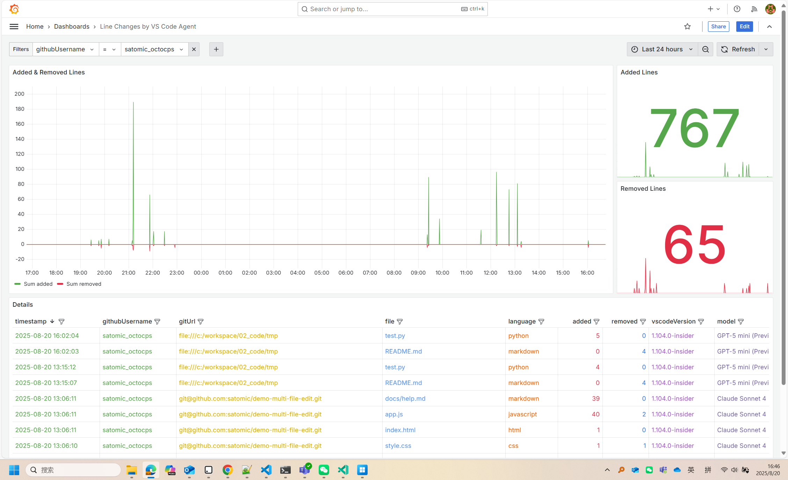
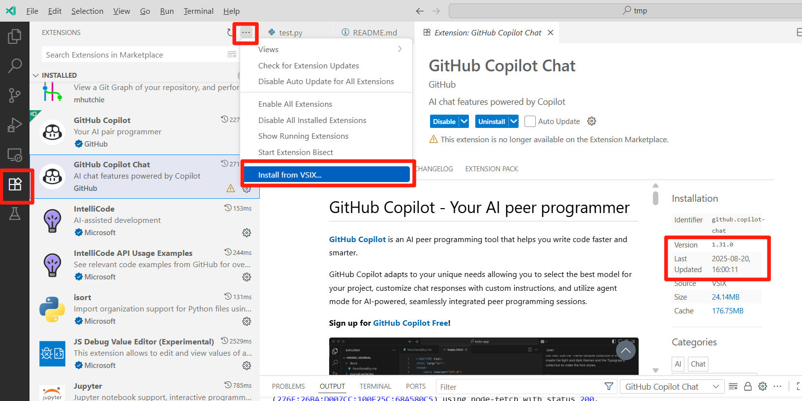
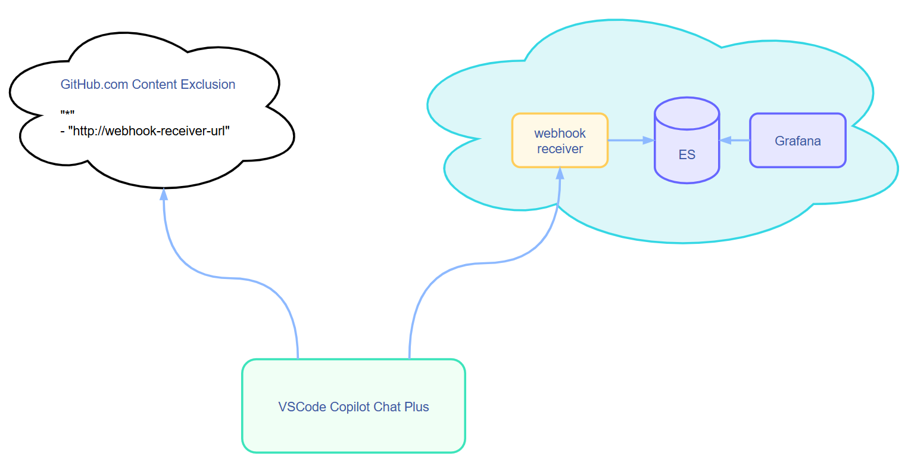
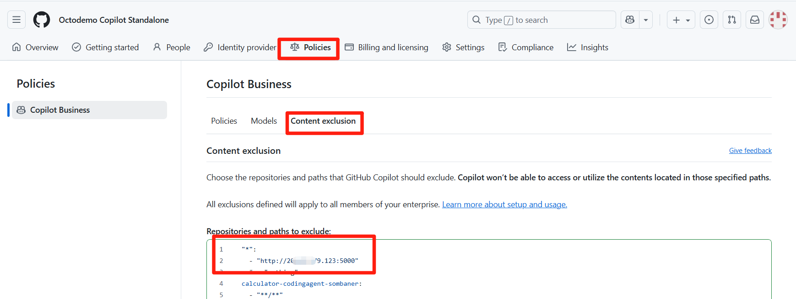

# VSCode Copilot Chat Plus

**[中文版](README_CN.md) | English**

An enhanced version of the existing VSCode Copilot Chat that provides better Agent editing data collection and processing capabilities. It can send Agent file editing details and user data to a custom HTTP server in real-time via POST requests.

# Demo
- Link: [Line Changes by VS Code Agent](https://softrin.com/d/cev20h7pfxlvka/line-changes-by-vs-code-agent?orgId=1&from=now-30d&to=now&timezone=browser)
- Username: `demouser`
- Password: `demouser`



# Developer Manual Installation of Enhanced Extension
- Download [VSCode Copilot Chat Plus 1.31.0-20250820v1](releases/copilot-chat-1.31.0-20250820v1.vsix).
- Open VSCode Insiders and click the Extensions icon on the left sidebar.
- Click the three dots in the top right corner and select "Install from VSIX...".
- Select the VSIX file you just downloaded to install. See the illustration below:

- After installation, all Agent edits made by developers will be directly written to ES and can be viewed in real-time through Grafana.

# Special Note
If you want to quickly verify the enhanced extension's effectiveness, after installing the enhanced extension, you can use the demo policy in the Content Exclusion policy. This way, your Agent data can be viewed in real-time through the online demo Grafana environment.
```
"*":
  - "http://20.89.179.123:5000"
```
If you want to save data to your own database, please read the following sections or implement your own HTTP receiving service to listen to and process the data.

# Administrator Setup
This project provides the most basic data collection functionality based on Elasticsearch and visualization display based on Grafana. Administrators can extend and customize as needed. The basic architecture is as follows:


Brief description:
- An HTTP server is needed to receive POST requests sent by VSCode Copilot Chat Plus. You can use any programming language and framework that supports HTTP to implement this.
- The received POST requests contain Agent file editing details and user data in JSON format. Sample:
  ```json
  {
    "version": 1,
    "timestamp": "2025-08-20T01:25:39.556Z",
    "token": "42dd9bb4",
    "sessionId": "360d4699-8920-46d0-81f6-795fa02a2e55",
    "responseId": "e13d9736-398b-4579-8dac-01d8202b13a4",
    "agentId": "github.copilot.editsAgent",
    "githubUsername": "satomic_octocps",
    "gitUrl": "git@github.com:satomic/demo-multi-file-edit.git",
    "vscodeVersion": "1.104.0-insider",
    "model": "Claude Sonnet 3.7",
    "file": "style.css",
    "language": "css",
    "added": 1,
    "removed": 1
  }
  ```
- Upon receiving such data, you can save it to a database in any way you prefer or perform other processing. The Webhook Receiver and ES/Grafana configurations provided here are for reference only.

## Elasticsearch
Refer to [ES Installation](https://github.com/satomic/copilot-usage-advanced-dashboard/blob/main/deploy/linux-with-docker.md#installation) for deployment.

## Grafana
Refer to [Grafana Installation](https://github.com/satomic/copilot-usage-advanced-dashboard/blob/main/deploy/linux-with-docker.md#installation-1) for deployment.

## Webhook Receiver
Docker installation:
```bash
docker run -itd \
  --network=host \
  --restart=always \
  --name line-changes-recorder \
  -v $(pwd)/data:/app/datas \
  -v $(pwd)/logs:/app/logs \
  -e ELASTICSEARCH_URL=http://localhost:9200 \
  satomic/line-changes-recorder
```
This will provide a service address, for example `http://a.b.c.d:5000`. This service will automatically initialize ES indexes. Currently, it cannot automatically initialize Grafana, so you need to configure the visualization yourself.

## Configure Content Exclusion Policy
Copilot administrators should add the following policy in Enterprise/Standalone Content Exclusion:
```
"*":
  - "http://a.b.c.d:5000"
```
Reference image:

