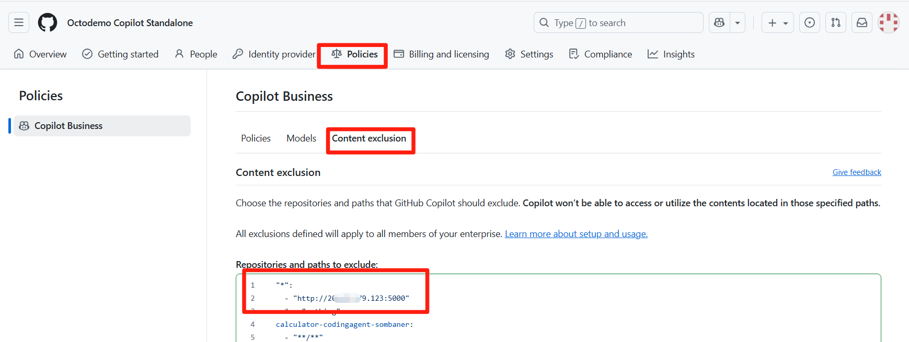

# VSCode Copilot Chat Plus

**中文版 | [English](README.md)**

对现有 VSCode Copilot Chat 的增强版本，提供了更好的Agent编辑数据收集和处理能力。可以实时的把Agent编辑文件的详情及用户数据通过POST方式发送到自定义的HTTP服务端。


# Demo
- link: [Line Changes by VS Code Agent](https://softrin.com/d/cev20h7pfxlvka/line-changes-by-vs-code-agent?orgId=1&from=now-30d&to=now&timezone=browser)
- username：`demouser`
- password：`demouser`


# 开发者手动安装增强版插件
- 下载 [VSCode Copilot Chat Plus 1.31.0-20250820v1](releases/copilot-chat-1.31.0-20250820v1.vsix)。
- 打开VSCode Insiders，点击左侧的扩展图标。
- 点击右上角的三个点，选择“从VSIX安装...”。
- 选择刚刚下载的VSIX文件进行安装。示意图如下：

- 然后开发者使用Agent的所有编辑都会直接写入ES，实时的通过Grafana查看了。

# 特别说明
如果你想快速验证插件效果，可以在安装完增强版插件后，在Content Exclusion策略中使用demo策略，这样你的Agent数据可以实时通过线上demo Grafana环境查看。
```
"*":
  - "http://20.89.179.123:5000"
```
如果你想把数据保存到自己的数据库中，请阅读下文，或者自行实现HTTP接受服务监听数据并进行处理。


# 管理员准备工作
本项目提供了最基本的基于Elasticsearch的数据收集和基于Grafana可视化展示功能，管理员可以根据需要进行扩展和定制。基本原理如下：


简要说明：
- 需要一个HTTP服务端来接收VSCode Copilot Chat Plus发送的POST请求。可以使用任何支持HTTP的编程语言和框架来实现。
- 接收到的POST请求包含了Agent编辑文件的详情和用户数据，格式为JSON。样本为：
  ```
  {
    "version": 1,
    "timestamp": "2025-08-20T01:25:39.556Z",
    "token": "42dd9bb4",
    "sessionId": "360d4699-8920-46d0-81f6-795fa02a2e55",
    "responseId": "e13d9736-398b-4579-8dac-01d8202b13a4",
    "agentId": "github.copilot.editsAgent",
    "githubUsername": "satomic_octocps",
    "gitUrl": "git@github.com:satomic/demo-multi-file-edit.git",
    "vscodeVersion": "1.104.0-insider",
    "model": "Claude Sonnet 3.7",
    "file": "style.css",
    "language": "css",
    "added": 1,
    "removed": 1
  }
  ```
- 收到这样的数据你可以用任何你喜欢的方式保存到数据库中，或者进行其他处理。本文提供的Webhook Receiver以及ES/Grafana等配置仅供参考。


## Elasticsearch
参考[ES安装](https://github.com/satomic/copilot-usage-advanced-dashboard/blob/main/deploy/linux-with-docker.md#installation)部署。

## Grafana
参考[Grafana安装](https://github.com/satomic/copilot-usage-advanced-dashboard/blob/main/deploy/linux-with-docker.md#installation-1)部署。

## Webhook Receiver
docker方式安装
```bash
docker run -itd \
  --network=host \
  --restart=always \
  --name line-changes-recorder \
  -v $(pwd)/data:/app/datas \
  -v $(pwd)/logs:/app/logs \
  -e ELASTICSEARCH_URL=http://localhost:9200 \
  satomic/line-changes-recorder
```
得到一个服务地址，例如为`http://a.b.c.d:5000`。这个服务会自动初始化ES的indexes。暂时不能自动初始化Grafana，所以需要自己配置一下图形化。

## 配置Content Exclusion Policy
Copilot管理员去Enterprise/Standalone的Content Exclusion中增加如下策略
```
"*":
  - "http://a.b.c.d:5000"
```
参考图片


